## 网络问题

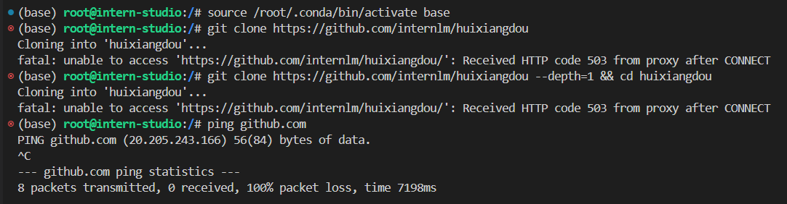

开发机平台有网络问题连不上 Github，不知道怎么回事。先放一天再说。

要解决的话我好像也不会解决。。。静等平台大佬修复。

参考项目是 [HuixiangDou](https://github.com/InternLM/HuixiangDou/tree/main)，运行的话也参考这个 [🔥 Run](https://github.com/InternLM/HuixiangDou/tree/main?tab=readme-ov-file#-run) 部分的教程。

#### 小问题

我的开发机连不上 GitHub 是怎么回事？

- 有时候会碰到上述 git clone 都完成不了的问题，简单粗暴的解决方式是建私有项目到码云，通过 URL 导入项目。反正目前没有给项目提 PR 的步骤，真的着急的话这么做应应急吧。

## 运行茴香豆

我们将以 lmdeploy & mmpose 为例，介绍如何把知识助手部署到飞书群

### STEP1. 建立话题特征库

复制下面所有命令（包含 '#' 符号）执行。（默认你已经做过 [Langchain 那节课]()的作业了，有对应的 conda 环境，用 `conda activate InternLM` 激活环境。）

```bash
# 下载 repo，网络不好的话记得把地址换成自己在码云上导入的私有仓库
git clone https://github.com/internlm/huixiangdou --depth=1 && cd huixiangdou

# 下载聊天话题，网络不好的话记得把地址换成自己在码云上导入的私有仓库
mkdir repodir
git clone https://github.com/open-mmlab/mmpose --depth=1 repodir/mmpose
git clone https://github.com/internlm/lmdeploy --depth=1 repodir/lmdeploy

# 建立特征库
mkdir workdir # 创建工作目录，执行下一步之前记得在开发机里创建虚拟环境
python3 -m pip install -r requirements.txt # 安装依赖，若 python3.11 则需要 `conda install conda-forge::faiss-gpu`
python3 -m huixiangdou.service.feature_store # 把 repodir 的特征保存到 workdir
```

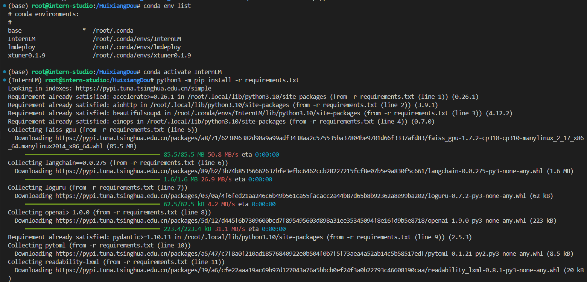

InternLM 环境里 python 是 3.10.13，其他的包基本都有，安装茴香豆的环境会把 Langchain 的版本降级，暂时看不出什么问题，就先不管。

首次运行将自动下载配置中的 [text2vec-large-chinese](https://huggingface.co/GanymedeNil/text2vec-large-chinese)。考虑到不同地区 huggingface 连接问题，建议先手动下载到本地，然后在 `config.ini` 设置模型路径。例如：

```ini
# config.ini
[feature_store]
..
model_path = "/path/to/text2vec-large-chinese"
```

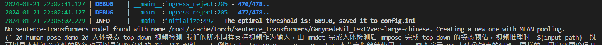

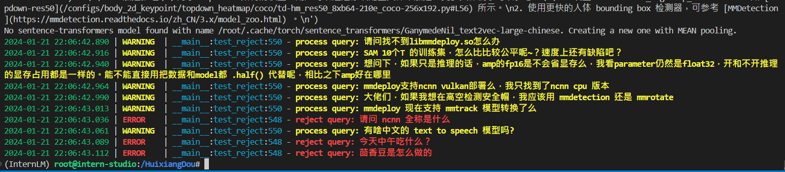

或者走镜像站，在第一课作业里面应该体验过了，`export HF_ENDPOINT=https://hf-mirror.com` 之后再重新执行上面的命令。

从执行结果上看不出什么区别，关键是去对应的位置上去找到底有没有模型

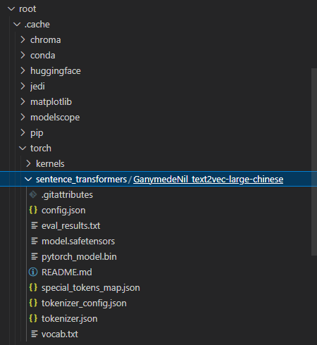

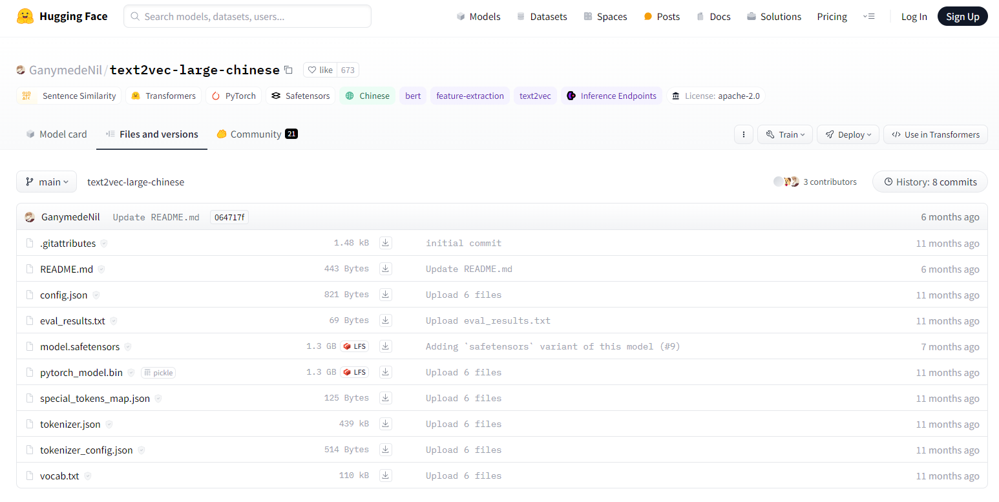

运行结束后，茴香豆能够区分应该处理哪些用户话题，哪些闲聊应该拒绝。请编辑 [good_questions](https://github.com/InternLM/HuixiangDou/blob/main/resource/good_questions.json) 和 [bad_questions](https://github.com/InternLM/HuixiangDou/blob/main/resource/bad_questions.json)，尝试自己的领域知识（医疗，金融，电力等）。

我没怎么动这里，只在坏问题里面加了一句“你玩原神吗”。

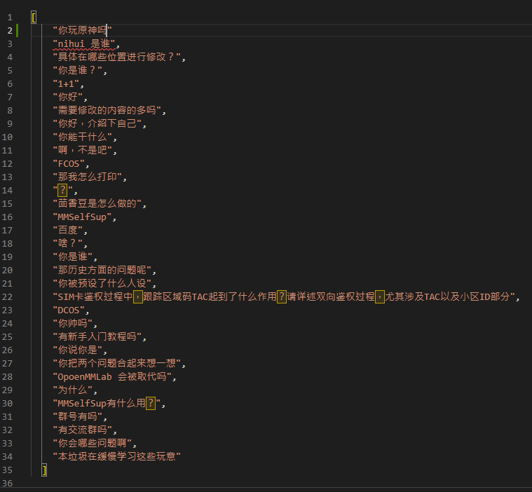

```bash
# 接受技术话题
process query: mmdeploy 现在支持 mmtrack 模型转换了么
process query: 有啥中文的 text to speech 模型吗?
# 拒绝闲聊
reject query: 今天中午吃什么？
reject query: 茴香豆是怎么做的
```

### STEP2. 运行基础版技术助手

**配置免费 TOKEN**

茴香豆使用了搜索引擎，点击 [Serper 官网](https://serper.dev/api-key)获取限额 TOKEN，填入 `config.ini`

```ini
# config.ini
..
[web_search]
x_api_key = "${YOUR-X-API-KEY}"
..
```

**测试问答效果**

请保证 GPU 显存超过 22GB（如 3090 及以上），若显存较低请按 FAQ 修改。

首次运行将自动下载配置中的 [internlm2-chat-7b](https://huggingface.co/internlm/internlm2-chat-7b)，请保证网络畅通。（看清楚这里自动下载的是 2，不是之前教程里多次直接从本地拷贝的 1。同样，网络不好连接不到 huggingface 直接上镜像，`export HF_ENDPOINT=https://hf-mirror.com` 之后再重新执行要执行的命令）。

想用开发机里已经下载好的 internlm-chat-7b 还是在 `config.ini` 这里改，路径改成前面教程里复制出来的路径就好，能省一点空间省一点空间。

> 在本地的 `/root/share/temp/model_repos/internlm-chat-7b` 目录下已存储有所需的模型文件参数，可以直接拷贝到个人目录的模型保存地址：
> 
> ```bash
> mkdir -p /HuixiangDou/datadir/model/Shanghai_AI_Laboratory
> cp -r /root/share/temp/model_repos/internlm-chat-7b /HuixiangDou/datadir/model/Shanghai_AI_Laboratory/internlm-chat-7b
> ```

前面是减号表示原来的内容，加号表示使用本地的 internlm-chat-7b 需要如何替换。

```ini
[llm.server]
- local_llm_path = "internlm/internlm2-chat-7b"
+ local_llm_path = "/HuixiangDou/datadir/model/Shanghai_AI_Laboratory/internlm-chat-7b"
local_llm_max_text_length = 16000
local_llm_bind_port = 8888
```

- **非 docker 用户**。如果你**不**使用 docker 环境，可以一次启动所有服务。

  ```bash
  # standalone
  python3 -m huixiangdou.main --standalone
  ..
  ErrorCode.SUCCESS,
  Query: 请教下视频流检测 跳帧  造成框一闪一闪的  有好的优化办法吗
  Reply:
  1. 帧率控制和跳帧策略是优化视频流检测性能的关键，但需要注意跳帧对检测结果的影响。
  2. 多线程处理和缓存机制可以提高检测效率，但需要注意检测结果的稳定性。
  3. 使用滑动窗口的方式可以减少跳帧和缓存对检测结果的影响。
  ```

如果要部署到 OpenXLab 里，选择 Gradio 应用也用不到 docker 吧我猜，咱们不给自己找事情，就用这个就够。

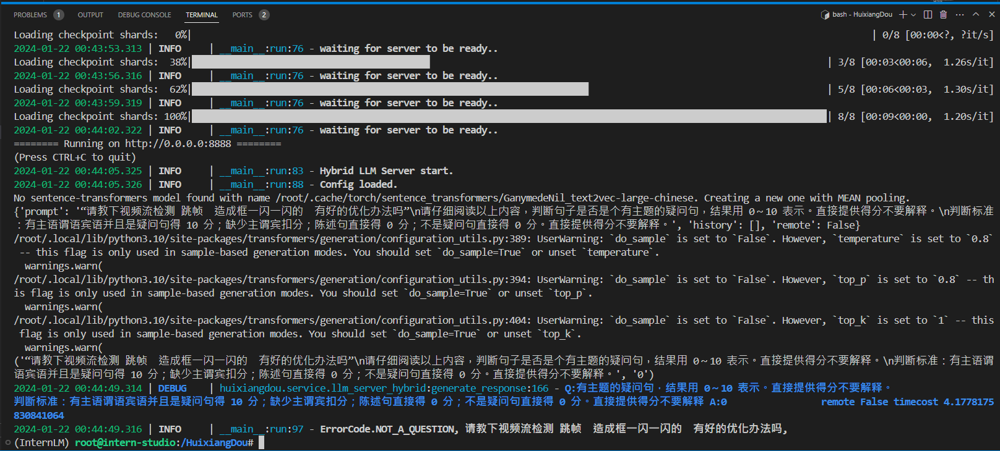

只用 internlm-chat-7b 好像不能把这个输入当成问题。和预期的结果不太一样。

### STEP3.集成到飞书[联网助手必选的功能]

点击[创建飞书自定义机器人](https://open.feishu.cn/document/client-docs/bot-v3/add-custom-bot)。（必须在电脑端创建，网页端和移动端不能创建自定义机器人）创建的时候会让你做安全设置，简单设置一下关键词先创建出来。现在只是大概跑一下看整个流程是怎么样的，这里可以把关键词设置成`"是"`，`"0"`，`"。"`这种一般人讲话绝对会出现的字符。

获取回调 WEBHOOK_URL，填写到 config.ini。不要把机器人对应的 URL 暴露出来，不然被别人拿到可能会觉得好玩狠狠调用然后机器人在群里说怪话最后把群给炸了。

```ini
# config.ini
..
[frontend]
type = "lark"
webhook_url = "${YOUR-LARK-WEBHOOK-URL}"
```

运行。结束后，技术助手的答复将发送到飞书群。

```bash
python3 -m huixiangdou.main --standalone # 非 docker 用户
python3 -m huixiangdou.main # docker 用户
```

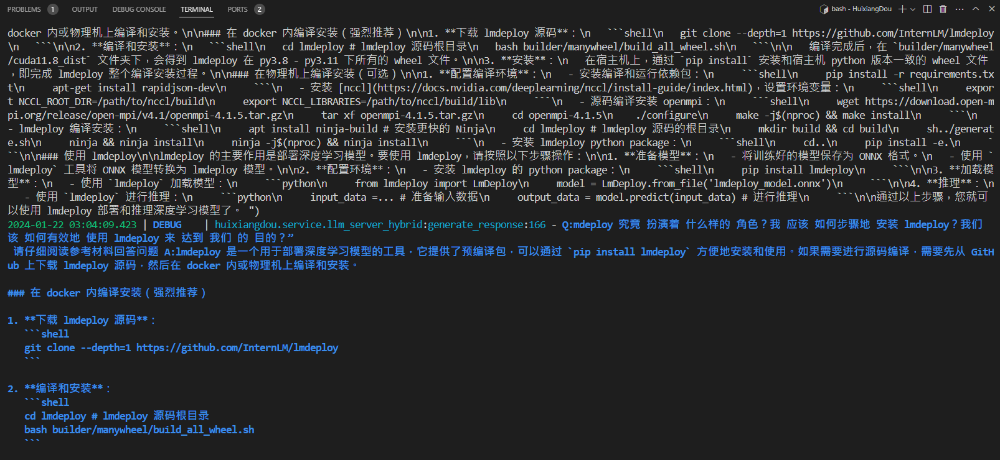

仔细看这幅图里蓝色的部分，`Q:` 后面的是我的原问题，`A:` 后面是大模型真正的回答。

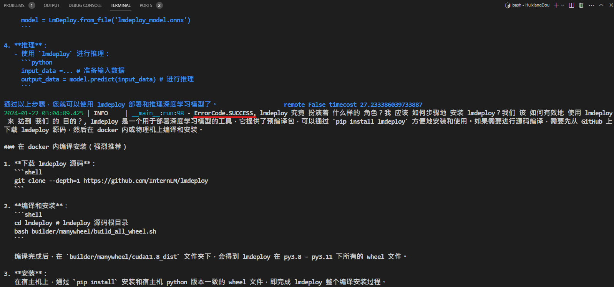

关键就是这个 `ErrorCode.SUCCESS`，出现这个之后表明茴香豆把我们的问题当问题了。

我们来看看群里的回复是什么样的

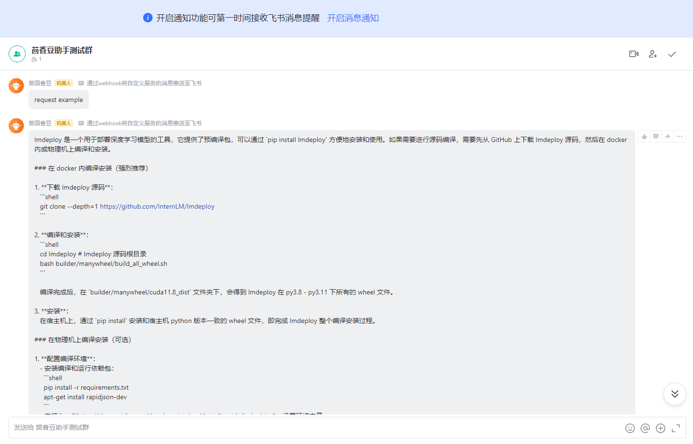

这样就算跑通了。（虽然富文本渲染失败了，但是能看懂吧）

#### 可能的问题

我按照上面的步骤一路走下来怎么机器人没反应的？，比如说和我之前犯的错类似会得到这样的回答

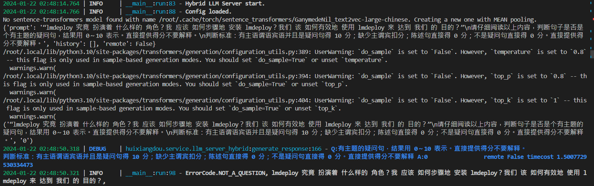

首先检查我提到的 `ErrorCode.SUCCESS`，有没有这个标志，这幅图里是没有的，然后去找源码看

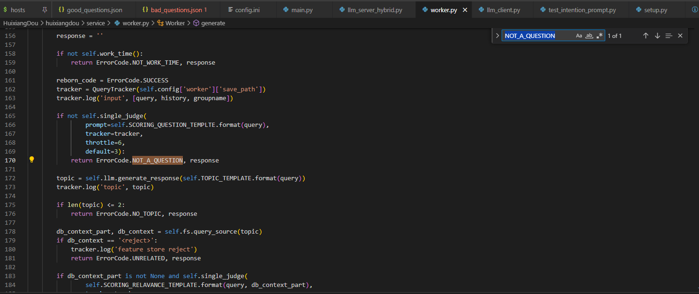

在 `HuixiangDou/huixiangdou/service/worker.py` 里面，根据调用 `self.single_judge()` 的结果输出的这个标志，追到这个函数上去

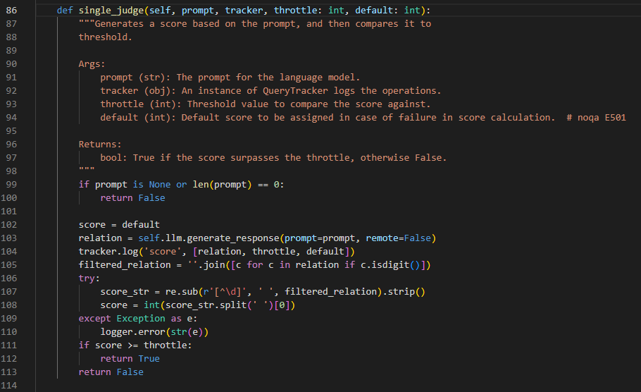

逻辑不算复杂，设置一个阈值，用户输入的得分比它高才算问题，同时设置默认值，对于一般的用户输入都拿这个值当基准，同时防止得分计算出问题，不能设置太低。

用户输入的得分是靠大模型的回应来计算的（计算的逻辑并不在这段代码里），根据前面的 prompt，大模型这里回应首先会是一个得分，把这个得分用正则表达式抠出来，和阈值进行对比。

也就是说得分多少完全看大模型心情。前面我试了很多各种各样的问题，都是拿 `good_questions.json` 里现成的问题去问的，结果全是这种 0 分的反应，我尝试让代码先跳过这一段，因为我当前的目的只是看一下大模型的回答能不能通过 webhook 传到机器人那边，也就是说我要跳过这个标志，直接不管什么回答先传过去试试。

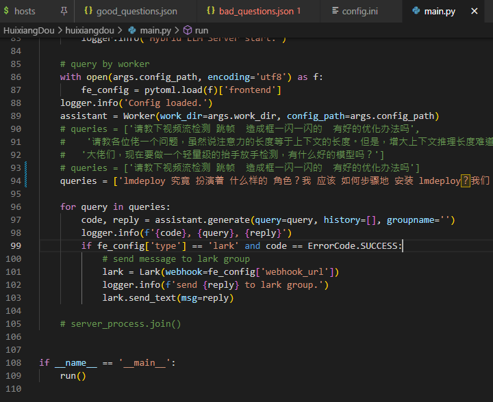

调用的逻辑还是得回到 `HuixiangDou/huixiangdou/main.py` 里面，刚才找的错误标志就是这个 `assistant.generate()` 输出的，我们把下面输出响应的判断条件从 `and` 改成 `or`，也就是改成 `if fe_config['type'] == 'lark' or code == ErrorCode.SUCCESS:` 这样，

结果会是什么样呢？

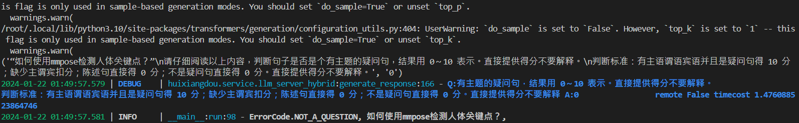

类似这样，注意看 `A:` 后面就一个 0，被摘掉之后就是空的了，而且截图里的最后一行是以逗号结尾的，最后的回应这里也没有字符串。

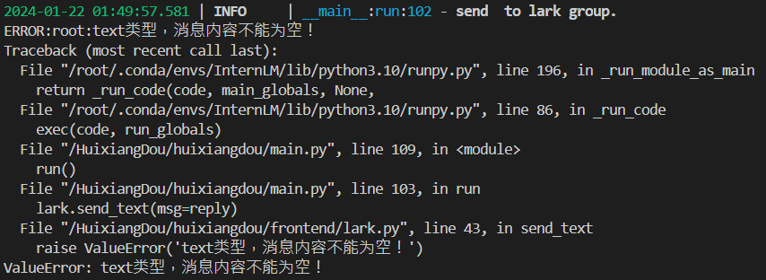

上图里第一行  send 和 to 之间有两个空格，回应还是空的。果然这样就报错了。看来这里不能这样乱改。

我又猜可能和一开始设置的阈值还有默认值有关，但是我试了一个最极端的组合阈值是 0 默认值是 10，模型还是给出 0 得分，这就有点怪异了，这只能是调用的模型不对劲。然后我就趁夜深人静把 `internlm2-chat-7b` 下载下来了。这下问题解决了。。。看来下载花的时间不能省，模型占的空间也不能省，问题在于前面几次作业我已经把重复的文件基本删掉了，云盘还是超量了，希望后面做作业的时候不要把这里的空间直接清除掉。